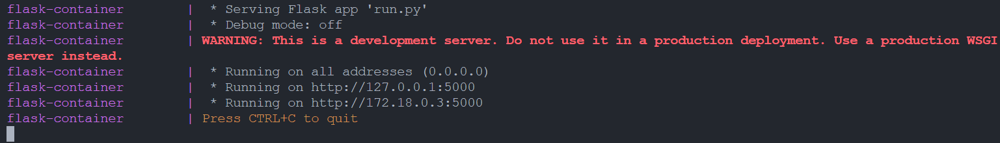

# Lancer le projet (Ca peut prendre un peu de temps)
docker-compose up --build

# Page d'acceuil
http://localhost:5000/
# Consulter la page admin:
http://localhost:5000/admin

#configuration de la base de donnée mysql
bd: digital_college
user: root
mdp: mysql
dossier contenant les données de la bd: ./sql_data

